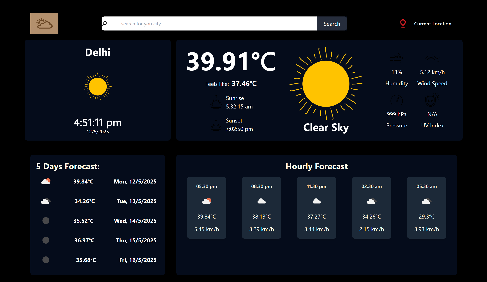

# 🌤️ Weather Forecast App

A sleek, responsive web app built with React that shows current weather, 5-day forecast, and hourly forecast based on user input or geolocation. Powered by the OpenWeatherMap API.

## 🖼️ Preview

 <!-- Add a screenshot named preview.png in the repo -->

## 🔥 Features

- 🌍 Search weather by city
- 📍 Get weather using your current location
- 📆 5-day weather forecast
- ⏰ Hourly weather forecast
- 💨 Wind speed and direction info
- ☁️ Weather condition icons
- 🔍 Responsive UI

## 🛠️ Tech Stack

- **Frontend:** React, Tailwind CSS
- **API:** [OpenWeatherMap](https://openweathermap.org/api)
- **Icons & UI Assets:** Emoji + openweathermap icons

## 📦 Installation

Clone the repo and install dependencies:

```bash
git clone https://github.com/your-username/weather-forecast-app.git
cd weather-forecast-app
npm install

```

## 🛠️🧩 Folder python
```
Structure
src/
├── components/
│   ├── Navbar.jsx
│   ├── ForeCast.jsx
│   └── CityAndTime.jsx
├── assets/
│   ├── logo.jpg
│   ├── search.png
│   └── location.png
├── App.jsx
└── main.jsx
```

## To-Do
- Add dark/light mode toggle

- Add error handling for invalid cities

- Deploy to Netlify or Vercel

## 📸 Screenshots
- Add your screenshots here to showcase the UI.

## 📄 License
- This project is open-source and free to use under the MIT License.

## 🤝 Contributing
- Pull requests are welcome. For major changes, please open an issue first to discuss.